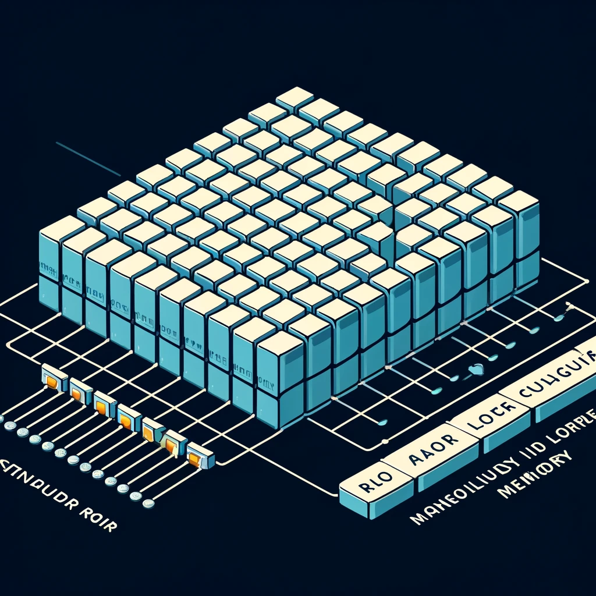
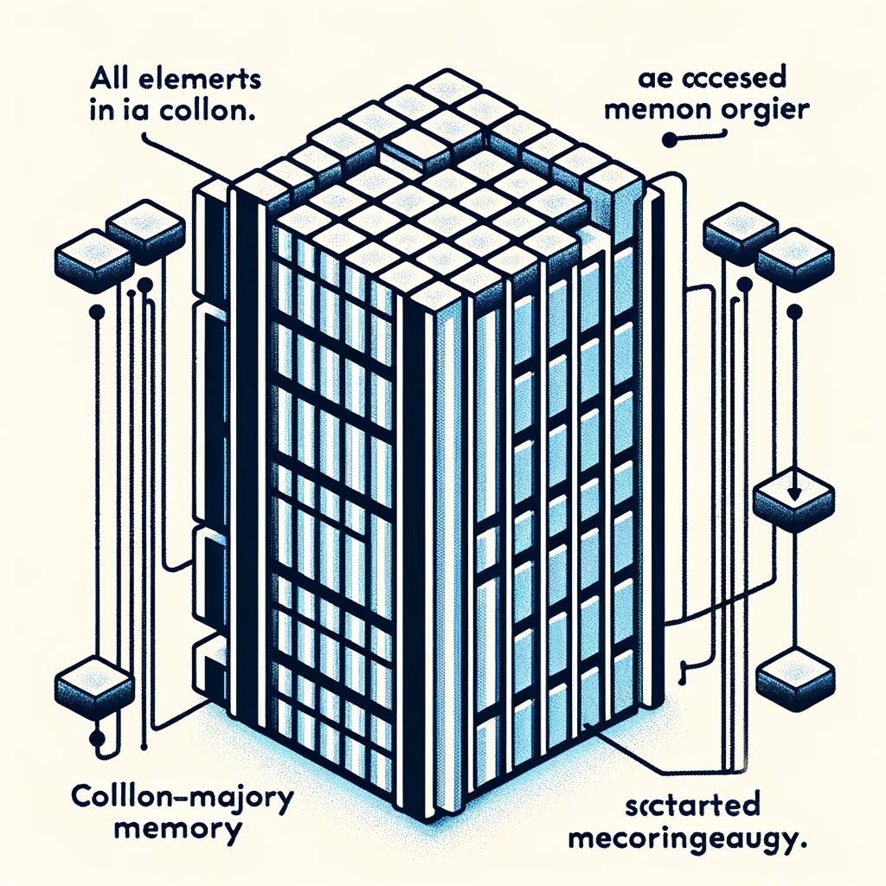
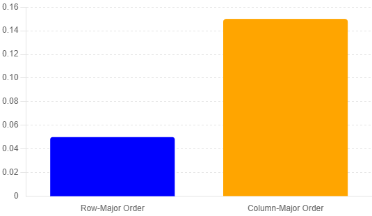

# Matrix Traversal Performance: Row-Major vs. Column-Major

This repository provides an example demonstrating the performance difference between row-major and column-major matrix traversal. Despite both traversals having \(O(N^2)\) time complexity, the practical execution times can vary significantly due to memory organization and cache behavior.

## Theoretical Background

### Complexity \(O(N^2)\)

The time complexity \(O(N^2)\) indicates that the execution time grows quadratically with the size of the input. For an \(N \times N\) matrix, both row-major and column-major traversals involve two nested loops, each iterating \(N\) times, resulting in \(N \times N\) operations. **In theory, according to Big O notation, both traversals should have the same execution time.**

```go
func sumRowMajor(matrix [][]int, N int) (int, time.Duration) {
	start := time.Now()
	sum := 0
	for row := 0; row < N; row++ {
		for column := 0; column < N; column++ {
			sum += matrix[row][column]
		}
	}
	return sum, time.Since(start)
}

func sumColumnMajor(matrix [][]int, N int) (int, time.Duration) {
	start := time.Now()
	sum := 0
	for row := 0; row < N; row++ {
		for column := 0; column < N; column++ {
			sum += matrix[column][row]
		}
	}
	return sum, time.Since(start)
}

```

## Practical Considerations

### Memory Locality and Cache

- **Row-Major Order**: Accesses elements stored contiguously in memory. Efficient use of cache as blocks of data are loaded together.
- **Column-Major Order**: Accesses elements stored non-contiguously, resulting in more cache misses and frequent memory access.

## Expected Results

- **Row-Major Traversal**: Significantly faster due to efficient cache usage.
- **Column-Major Traversal**: Slower due to frequent memory access and cache misses.

## Visual Explanations

### Memory Layout Diagrams

#### Row-Major Order


#### Column-Major Order


### Execution Time Comparison


## Conclusion

Understanding the underlying hardware and memory organization is crucial for optimizing algorithms that handle large datasets. While theoretical complexity provides a high-level understanding, practical performance can differ due to factors like memory locality and cache behavior.

---

Let's optimize our algorithms by considering the hardware they run on! 💪

#SoftwareEngineering #Performance #Algorithms #Optimization #GoLang #Memory #Cache #Computing
